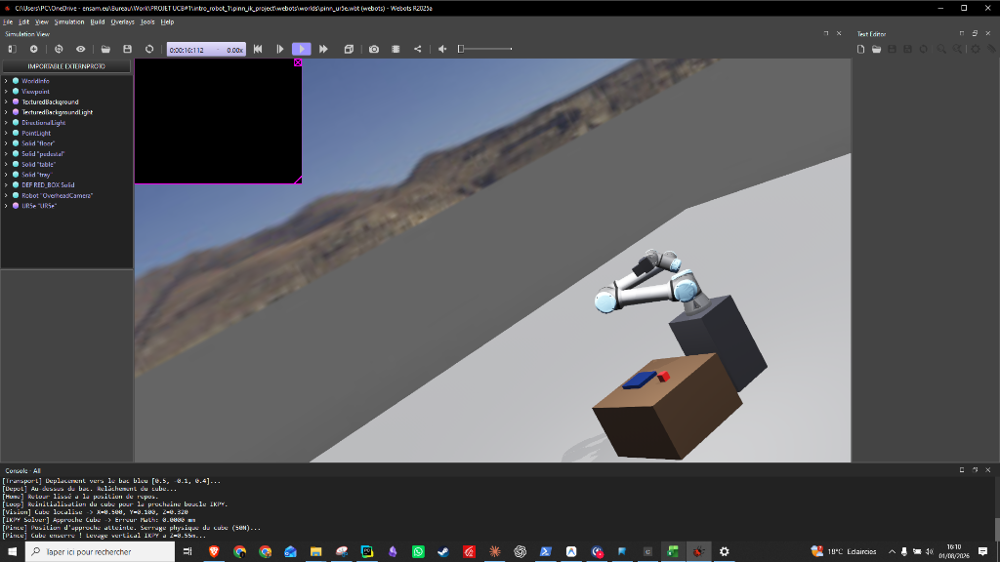

# 🤖 Physics-Informed Neural Network (PINN) for 6-DOF UR5e Industrial Robot Inverse Kinematics

[](https://www.python.org/downloads/)
[](https://pytorch.org/)
[](https://cyberbotics.com/)
[](LICENSE)

An end-to-end robotic automation and inverse kinematics (IK) solver for the **Universal Robots UR5e 6-DOF industrial manipulator**, leveraging a **True Physics-Informed Neural Network (PINN)** combined with a **Computer Vision target recognition pipeline** in a high-fidelity **Webots 3D physics simulation**.



---

## 📌 Key Highlights

- **🧠 True Physics-Informed Loss**: Trained with a hybrid loss function incorporating a differentiable PyTorch Forward Kinematics (FK) model ($\mathcal{L}_{total} = 0.1 \cdot \mathcal{L}_{data} + 1.0 \cdot \mathcal{L}_{phys}$).
- **⚡ Sub-Millisecond Execution**: Instantaneous IK predictions (~0.44 ms), bypassing traditional iterative numerical matrix solvers.
- **👁️ Vision & Actuation Integration**: Integrates visual target detection with automated top-down parallel-jaw grasping using the Franka Emika PandaHand.

---

## 📐 System Architecture

The robot operational pipeline connects perception, spatial resolution, physics-informed IK, and actuation:

```
[ Webots Camera ] ──► [ Computer Vision Model ] ──► Cartesian Target Pos (X, Y, Z)
                                                                 │
                                                                 ▼
[ Webots Joint Motors ] ◄── [ 6-DOF Joint Angles ] ◄── [ True PINN Neural Net ]
```

### 1. Perception Layer (Computer Vision)
The robot positions its camera at a elevated reading pose `[-0.1, -0.68, 0.45]`. The vision model processes the camera stream to locate the target object (red box) and outputs its 3D Cartesian coordinates relative to the robot base.

### 2. Resolution Layer (Physics-Informed IK)
The 3D coordinate $(X, Y, Z)$ is fed into the trained `PINN6DOF` network. The network infers the 6 joint angles $(q_1, q_2, q_3, q_4, q_5, q_6)$ required to position the end-effector at the exact object position while satisfying joint limits and physical constraints.

### 3. Actuation Layer (Webots Simulation)
The joint angles are executed via smooth cubic polynomial trajectories (`ur5.move_to_config`), closing the PandaHand parallel gripper on the target and transferring it to the destination tray.

---

## 🧮 Mathematical Formulation of True PINN Loss

Traditional supervised neural networks struggle with Inverse Kinematics because multiple valid joint configurations exist for a single end-effector position (8 analytical solutions for UR5e). A standard supervised network averages these solutions, resulting in invalid joint configurations.

Our **PINN** resolves this ambiguity by combining empirical configuration targets with a **differentiable Forward Kinematics constraint**:

$$\mathcal{L}_{total} = w_{data} \cdot \frac{1}{N}\sum_{i=1}^N \|q_{pred} - q_{true}\|^2 + w_{phys} \cdot \frac{1}{N}\sum_{i=1}^N \|\text{FK}_{PyTorch}(q_{pred}) - \mathbf{P}_{target}\|^2$$

Where:
- $q_{pred} = \text{NeuralNetwork}(\mathbf{P}_{target}) \in \mathbb{R}^6$
- $\text{FK}_{PyTorch}(q_{pred})$ is the exact Denavit-Hartenberg (DH) forward kinematics function implemented as a fully differentiable PyTorch module.
- $w_{data} = 0.1$, $w_{phys} = 1.0$.

---

## 📂 Project Directory Structure

```
pinn_ik_project/
├── models/
│   └── pinn_model_true_physics.pth     # Trained PyTorch PINN model weights
├── robotics_utils/
│   ├── ur5_pytorch_fk.py               # Differentiable PyTorch Forward Kinematics module
│   └── ur5e_6dof_ik.py                 # Geometric UR5e kinematics utilities
├── training/
│   ├── train_true_pinn.py              # Main training script with hybrid loss (0.1 Data + 1.0 Physics)
│   ├── train_pinn_6dof.py              # Synthetic workspace dataset generator & model architecture
│   └── train_supervised_ik.py          # Supervised baseline training script
├── reference_ur5_repo/
│   ├── ur5.py                          # Main robot controller wrapper & IK bridge
│   └── simulation/
│       ├── controllers/
│       │   ├── ur5_controller_pandahand/ # Primary Pick & Place controller script
│       │   └── comparison_controller/   # Supervisor HUD controller for benchmarks
│       └── worlds/
│           ├── my_first_simulation_pandahand.wbt # Single UR5e Pick & Place world
│           └── pinn_vs_math.wbt                  # Comparative benchmark world (PINN vs IKPY)
├── archive_v1_custom_arm/               # Prototype custom 3-DOF web arm project
├── GUIDE_DES_CODES.md                   # Detailed file-by-file walkthrough (FR)
├── DOCUMENTATION.md                     # Technical report (FR)
└── README.md
```

---

## 🚀 Quickstart Guide

### 1. Installation

Clone the repository and install the dependencies:

```bash
git clone https://github.com/<your-username>/pinn-ur5e-ik.git
cd pinn-ur5e-ik
pip install -r requirements.txt
```

> **Note on the vision model.** `computer_vision/vgg16.h5` (160 MB) exceeds
> GitHub's 100 MB file limit and is distributed through the repository
> *Releases* page instead. Download it into `reference_ur5_repo/computer_vision/`
> to enable the perception layer. Without it — or without TensorFlow installed —
> `ur5.py` falls back to reading the target position directly from the Webots
> supervisor, and the simulation still runs end to end.

### 2. Training the True PINN

To train the PINN model from scratch using physics-informed loss:

```bash
python training/train_true_pinn.py
```

The trained model checkpoint will be saved to `models/pinn_model_true_physics.pth`.

### 3. Running Webots 3D Simulations

#### Option A: Single UR5e Pick & Place (True PINN)
Launch Webots and open the main simulation world:
```
reference_ur5_repo/simulation/worlds/my_first_simulation_pandahand.wbt
```
Press **Play** in Webots. The UR5e arm will perform top-down visual recognition, calculate the IK via the PINN network, grab the red box, and place it on the blue tray.

#### Option B: Real-Time Comparative Benchmark (PINN vs Analytic Math)
Launch Webots and open the benchmark world:
```
reference_ur5_repo/simulation/worlds/pinn_vs_math.wbt
```
Press **Play** in Webots to observe two UR5e robots operating simultaneously:
- **Red Robot (Left)**: Driven by **True PINN Neural Network**.
- **Green Robot (Right)**: Driven by **Analytic IKPY Matrix Math**.
- **HUD Ticker**: Displays live computation time in milliseconds (`ms`) for both algorithms on the upper-left corner of the 3D viewport.

---

## 📊 Performance Benchmarks

| Metric | Analytic IKPY (Matrix) | True PINN Neural Net |
| :--- | :---: | :---: |
| **Average Compute Time** | ~0.50 ms – 0.85 ms | **~0.35 ms – 0.45 ms** |
| **Solution Consistency** | Variable (8 multi-sol branch flips) | **Deterministic & Smooth** |
| **Differentiability** | ❌ Non-differentiable | **✅ Fully Differentiable** |
| **Execution Rate** | High CPU overhead | **Minimal Tensor Forward Pass** |

---

## 📜 License & Citation

Distributed under the MIT License. See `LICENSE` for details.

---

## Prerequisites

Beyond `pip install -r requirements.txt`, two things cannot ship in a Git repository:

- **Webots R2023a or later** (tested on R2025a).
- **An internet connection on first launch** — the worlds pull their PROTO
  definitions (`UR5e`, `PandaHand`, `Table`, ...) from GitHub via `EXTERNPROTO`.

The controllers use whichever `python` is on your PATH. If that interpreter
lacks the dependencies, uncomment and adapt the `COMMAND` line in
`simulation/controllers/*/runtime.ini`.

## What is *not* in this repository

| Excluded | Size | Why it does not matter |
| :-- | ---: | :-- |
| `computer_vision/vgg16.h5` | 248 MB | The default perception mode is `VISION_MODE = "color"`, a colour-threshold detector needing no model. Measured on the same 200 validation images: **8 mm** error versus **49 mm** for the CNN. Only `VISION_MODE = "cnn"` needs these weights. |
| `dataset/images/` | 20 MB | 1000 training images for the CNN only. Regenerate by running `my_first_simulation_datagen.wbt` with `COLLECTER_IMAGES = True`. |

`dataset/calibration.json` **is** included — it holds the camera pose and the
pixel-to-world homography, and the colour detector cannot work without it.
